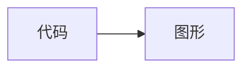

# dsh-mermaid

简体中文 | [English](README.md)

在 DeepSeek Harness Web 会话中把 Mermaid 围栏代码块渲染为 SVG 图形，并提供**代码 / 图形**双向切换。插件支持流式输出、深色主题、全屏查看、缩放与拖拽、SVG 导出，并在渲染失败时自动回退到源代码。

[](https://www.npmjs.com/package/dsh-mermaid)

## 功能特性

- 支持 `mermaid`、`mermaidjs` 和 `mmd` 围栏代码块
- 兼容 DSH/Shiki plain fallback，此时代码元素可能没有 language class
- 固定并打包 Mermaid `11.17.0`，运行时不依赖 CDN
- 仅在首次检测到 Mermaid 代码块后，才从 DSH 同源加载已打包的 Mermaid 运行时
- 多图通过串行队列逐个渲染，并在图形之间让出主线程，降低页面卡顿
- 使用 Mermaid `securityLevel: strict`
- 抑制 Mermaid 内置的解析错误 SVG，使渲染失败时干净地回退源码，不在页面中遗留临时错误图
- 支持全屏查看，并提供缩放、拖拽、恢复 100% 和适应窗口操作
- 全屏查看时把键盘焦点限制在对话框内、隔离背景内容，并在关闭后把焦点还给触发按钮
- 向辅助技术播报渲染与下载状态，并为生成的 SVG 图形提供可访问名称
- 可直接通过卡片按钮把已渲染图形导出为独立 SVG 文件
- 在代码和图形视图中始终提供全屏与 SVG 下载操作，并在切换时保持工具栏位置稳定
- 根据页面和浏览器语言自动使用简体中文或英文界面及状态文案
- 只增强 `<pre><code>` 代码块，不处理行内代码
- 防止旧的异步渲染结果覆盖较新的流式内容
- 单图超过 50,000 字符或 2,000 行时，在调用 Mermaid 前拒绝渲染并回退源码

## 兼容性

最后验证环境为 2026-09-05 的 `@deepseek-ai/dsh 0.1.2-rc.1` 与 Node.js 22.23.2。DSH 当前仍处于开发预览阶段，后续版本可能包含破坏性兼容变化；如果新版 DSH 调整了插件加载器或 Markdown DOM，请提交 issue。

## 安装

如果已经全局安装 `dsh`，通过 npm 稳定版安装：

```powershell
dsh plugin --profile web add -w dsh-mermaid
```

如果没有全局 `dsh` 命令，可以通过 npx 调用 DSH：

```powershell
npx.cmd --yes @deepseek-ai/dsh plugin --profile web add -w dsh-mermaid
```

DSH 会通过 pnpm 安装包、识别其中的 `dsh.bundle` 声明，并自动把 `dsh-mermaid` 加入 web profile 的 bundles。安装完成后重启 DSH Web 或刷新页面。

### 安装 GitHub 最新源码版

```powershell
npx.cmd -y github:MrmoLabs/dsh-mermaid install
```

该命令会运行仓库提供的 `dsh-mermaid` 安装器，再让 DSH 把 GitHub 源安装到 web profile。GitHub 源会在安装阶段构建。如果 pnpm 提示阻止了 build script，请把它输出的精确包名加入 profile 的 `pnpm-workspace.yaml` `allowBuilds`，然后重新执行命令。普通用户建议优先使用 npm 稳定版。

## 更新和卸载

更新 npm 稳定版：

```powershell
dsh plugin --profile web update -w dsh-mermaid
```

卸载：

```powershell
dsh plugin --profile web remove -w dsh-mermaid
```

更新或卸载后请重启 DSH Web。

## 使用方法

让模型输出 Mermaid 围栏代码块：

````markdown

````

代码块上方会出现**代码 / 图形**按钮，默认显示图形。

## 从源码开发

需要 Node.js 22.19 或更高版本。

```powershell
npm.cmd install
npm.cmd run check
npm.cmd run build
dsh plugin --profile web add -w .
```

构建产物位于 `lib/`。轻量的 `client.js` 启动器由 DSH 客户端模块加载器注册为 `dsh-mermaid`，打包后的 Mermaid 运行时则通过插件的同源宿主路由按需加载。DSH 会以当前插件项目为基准解析相对安装路径。

本地开发时，也可以手动把构建后的包复制到：

```text
C:\Users\<用户名>\.dsh\profiles\web\node_modules\dsh-mermaid
```

不要把整个 `.dsh` 目录提交到 Git，其中可能包含会话和凭据。

## 发布检查

```powershell
npm.cmd run check
npm.cmd run build
npm.cmd pack --dry-run
git status --short
git diff --cached
```

## 许可证

[MIT](LICENSE)
